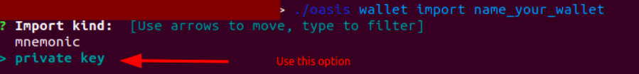
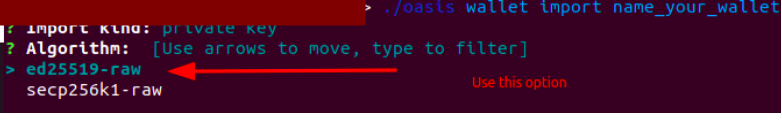
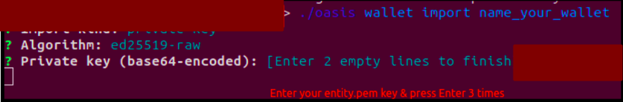
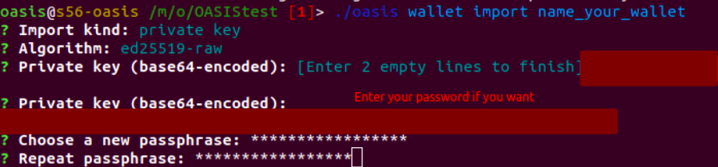

This guide covers setting up the Oasis Emerald ParaTime node on the mainnet.
You will receive rewards for running an Oasis Emerald ParaTime node on the mainnet. 

You will need three servers: 
* The first server (“Server A”) is for a validator on the mainnet. [Follow these instructions to install it](https://github.com/everstake/oasis-documentation/blob/main/How_to_Set_Up_validator_Oasis_Network_mainnet.md). 
* The second server (“Server B”) is for storing key files and creating transactions. [Follow these instructions to install it and save key files for a consensus validator.](https://github.com/everstake/oasis-documentation/blob/main/How_to_Set_Up_validator_Oasis_Network_mainnet.md). 
* The third server (“Server C”) is for the Emerald ParaTime node on the mainnet. We will configure this host in the guide.

### Prerequisites:
1. An active validator node (if you have not set up a validator yet,  [set up a validator node first](https://github.com/everstake/oasis-documentation/blob/main/How_to_Set_Up_validator_Oasis_Network_mainnet.md)).
2. Servers A and B.

### Requirements for Emerald ParaTime Node:
- CPU: 2.0 GHz x86-64 CPU with 4 cores/vCPUs with AES instruction set and AVX2 support.
- RAM: 16 GB of ECC RAM.
- Disk: 700 GB of SSD or NVMe fast storage. Although the recommended requirement is 700 GB, we use pruning, and our database takes up much less space. We think a 240 GB drive is enough for disk scaling.
- Minimum network requirements: 200 Mbps internet connection with low latency.
  Recommended network parameters: 1 Gbps internet connection with low latency.
- We are using Ubuntu 20.04 OS.
 

You must deposit 300 ROSE to your validator's address (entity address) and reserve a few tokens for transactions fees. 
### How to set up an Emerald ParaTime node:
All transactions are created and signed on [localhost without an internet connection](https://docs.oasis.dev/general/run-a-node/set-up-your-node/run-validator#systems), so we store the private key (entity.pem) on localhost (Server B). 

To avoid issues with the validator node, we set up a separate node for Emerald ParaTime. However, Oasis allows you to create a ParaTime node on the validator. 


#### Step 1: Install a non-validator node on Server C
Create a user: 
```
sudo useradd -m oasis
#Add user to group sudo
sudo usermod -aG sudo oasis
#In next we perform all operation from user oasis
#Change user to Oasis 
sudo -s
su oasis
```
Create a var: 
```
#This directory must have access to 240 GB and be scalable 
OASIS_PATH=”You_puth_to_folder_for_oasis”
EXTERNAL_IP=”You_external_IP”
echo 'export OASIS_PATH='${OASIS_PATH} >> $HOME/.profile
echo 'export EXTERNAL_IP='${EXTERNAL_IP} >> $HOME/.profile
source $HOME/.profile
```
Create a folder for Oasis:
```
#Create folders 
mkdir -p $OASIS_PATH/node/etc
mkdir $OASIS_PATH/node/data
#Change directory access rights 
sudo chmod 700 $OASIS_PATH/node/etc
sudo chmod 700 $OASIS_PATH/node/data
```
Clone this repo:
```
cd $OASIS_PATH
git clone git@github.com:everstake/oasis-documentation.git
```
Copy a config file with edits on base pruning and more optimal configuration.
The config is for version 22.1.7. A config for newer versions of oasis-core may differ. [See the official documentation.
](https://docs.oasis.dev/general/run-a-node/set-up-your-node/run-non-validator#configuration).
```
#Copy config file
cp $OASIS_PATH/oasis-documentation/config/config_oasis_mainnet_non_validator.yml  $OASIS_PATH/node/etc/
#Change the path in the config file  
sed -i.bak -e "s|\/node|$OASIS_PATH\/node|g" $OASIS_PATH/node/etc/config_oasis_mainnet_non_validator.yml
#Change the name of the config file 
mv $OASIS_PATH/node/etc/config_oasis_mainnet_non_validator.yml $OASIS_PATH/node/etc/config.yml
```
Create a system.d unit:
```
sudo vim /etc/systemd/system/oasis-mainnet.service

[Unit]
Description=Crypto OASIS
After=network-online.target
[Service]
Type=simple
Restart=always
RestartSec=5
TimeoutSec=30
User=oasis
WorkingDirectory=PATH
ExecStart=PATH/oasis-node --config PATH/node/etc/config.yml
StandardOutput=append:PATH/stdout.txt
StandardError=append:PATH/stderr.txt
StartLimitInterval=15
LimitSTACK=65535
LimitNOFILE=102400
[Install]
WantedBy=multi-user.target

#Replace your path on system.d to oasis folder 
sudo sed -i.bak -e "s|PATH|$OASIS_PATH|g" /etc/systemd/system/oasis-mainnet.service
```
[Download the current genesis version:](https://docs.oasis.dev/general/oasis-network/network-parameters/)
```
wget --directory-prefix=$OASIS_PATH/node/etc/ https://github.com/oasisprotocol/mainnet-artifacts/releases/download/2022-04-11/genesis.json
#Please check if the version of genesis is actual according to the Oasis documentation. You can check this with the below command:
sha256sum $OASIS_PATH/node/etc/genesis.json
```
Download the current Oasis Core version
We use version 22.1.7. [Please check the current oasis-core according to the documentation.](https://docs.oasis.dev/general/oasis-network/network-parameters/):
```
wget --directory-prefix=$OASIS_PATH https://github.com/oasisprotocol/oasis-core/releases/download/v22.1.7/oasis_core_22.1.7_linux_amd64.tar.gz
tar -xvzf oasis_core_xxxx_linux_amd64.tar.gz
cp oasis_core_xxxx_linux_amd64/oasis-node $OASIS_PATH/
```
Add iptables rules for P2P:
```
#Add rule for p2p oasis consensus
sudo iptables -A INPUT -p tcp -i <Name_your_external_interface>  --dport 26656 -j ACCEPT -m comment --comment "p2p Oasis"
#Add rule for p2p worker for oasis paratime
sudo iptables -A INPUT -p tcp -i <Name_your_external_interface>  --dport 30002 -j ACCEPT -m comment --comment " p2p worker Emerland Oasis"
#Save rules
sudo netfilter-persistent save
```
Start Oasis and wait until it is synced: 
```
sudo systemctl daemon-reload
sudo systemctl start oasis-mainnet.service
#Checking if node is synced
$OASIS_PATH/oasis-node control is-synced -a unix:$OASIS_PATH/node/data/internal.sock
```
```
#You must see this output:
node completed initial syncing
```
Wait for the node to sync and then proceed to Step 2. 

#### Step 2: Create a var on Server B:
```
#Check path to oasis folder
echo $OASIS_PATH
#If you don’t have path pls do next command
OASIS_PATH=”You_puth_to_folder_for_oasis”
echo 'export OASIS_PATH='${OASIS_PATH} >> $HOME/.profile
source $HOME/.profile
```
#### Step 3: Update the entity on Server B:

Generate a file node_genesis.json. It's bounded to the public key (entity.pub). 
We need to change the entity for our Server C to register in the network. It means adding the public key of the ParaTime node to our entity. Also, we will update the entity on the validator node. 
 
Check if you have folders with validator keys.If you don't have folders and files like bellow, follow step 9 in this manual:
```
tree $OASIS_PATH/node/Mainnet_validator_key
output:
Mainnet_validator_key/
├── entity
│   ├── entity_genesis.json
│   ├── entity.json
│   └── entity.pem
└── node
    ├── consensus.pem
    ├── consensus_pub.pem
    ├── identity.pem
    ├── identity_pub.pem
    ├── node_genesis.json
    ├── p2p_entropy.pem
    ├── p2p.pem
    ├── p2p_pub.pem
    ├── sentry_client_tls_identity_cert.pem
    ├── sentry_client_tls_identity.pem
    ├── tls_ephemeral_next.pem
    ├── tls_ephemeral.pem
    ├── vrf.pem
    └── vrf_pub.pem
```
Create new *pem files node_genesis.json for the ParaTime node:
```
#Get the "id" of your entity
cat $OASIS_PATH/entity/entity.json

output:{
  "v": 2,
  "id": "Q6fkQRRrE6jbvJ546I77N+nVaOku0/hNduY6LBcEz80=",
  "nodes": [
    "NfSSIP66pWgjtzqAFEUmsjX25OD8p2gcIJ8ooBwV1ss="
  ]
}
 
#Init ParaTime node (creating new *pem files & node_genesis.json for ParaTime node with your entity “id”)
$OASIS_PATH/oasis-node registry node init \
  --node.entity_id Q6fkQRRrE6jbvJ546I77N+nVaOku0/hNduY6LBcEz80= \
  --datadir $OASIS_PATH/Mainnet_paratime_emerald_key
```
Update your entity (add a new ParaTime node key to the entity):
```
#Below you enter the path to the two node_genesis.json files which are bound to host A & C
$OASIS_PATH/oasis-node registry entity update \
  --entity.node.descriptor ./Mainnet_validator_key/node/node_genesis.json,$OASIS_PATH/Mainnet_paratime_key/node/node_genesis.json \
  --signer.dir $OASIS_PATH/entity
```
Check entity:
```sh
cat $OASIS_PATH/entity/entity.json 

output: {
     "v": 2,
     "id": "Q6fkQRRrE6jbvJ546I77N+nVaOku0/hNduY6LBcEz80=",
     "nodes": [
       "NfSSIP66pWgjtzqAFEUmsjX25OD8p2gcIJ8ooBwV1ss=",
>>>    "StLAQLpJMv0nZSlx9r42X8b3nti85mIV/v8LlFABnlU="   <<<
  ]
} 
```
We can see that a second node "ID" (for ParaTime Node) is added.

#### Step 4: Make a transaction for registration of a new entity on Server B and then copy it to Server A:
```sh
#Current nonce you can see with the below command. You will need this nonce later (on server A)
$OASIS_PATH/oasis-node stake account info -a unix:$OASIS_PATH/node/data/internal.sock --stake.account.address <Your_validartor_entity_adress> | grep Nonce

output:
Nonce: 6

#Input: --transaction.nonce (nonce is a transaction number, which increases by one with each next transaction); --transaction.file (path in which the transaction file will be saved)(on server B)
$OASIS_PATH/oasis-node registry entity gen_register \
  --genesis.file ./etc/genesis.json \
  --signer.backend file \
  --signer.dir ./entity \
  --transaction.file ./tx/tx_<your_current_nonce>_reg_entity_update.tx \
  --transaction.fee.gas 3493 \
  --transaction.fee.amount 1000 \
  --transaction.nonce <your_current_nonce>
```

Copy a transaction file to Server A:
```sh
rsync $OASIS_PATH/tx/tx_<your_current_nonce>_reg_entity_update.tx user@ip_address_host_A:<Your_path_to_oasis_folder>/oasis/node/tx/
```
#### Step 5: Send a transaction to the Consensus layer on Server A.
```sh
$OASIS_PATH/oasis-node consensus submit_tx \
 --transaction.file $OASIS_PATH/tx/tx_<your_current_nonce>_reg_entity_update.tx \
 -a unix:$OASIS_PATH/node/data/internal.sock 
```
#### Step 6: Copy a new entity from Server B to Server A:

Back up the entity and *pem files on Server A & delete them:
```sh
mkdir -p $OASIS_PATH/backup/node/data/
mkdir $OASIS_PATH/node/data/tendermint
#Backup old key files
cp -r $OASIS_PATH/node/data/*pem $OASIS_PATH/backup/node/data
cp -r $OASIS_PATH/node/data/node_genesis.json $OASIS_PATH/backup/node/data
cp -r $OASIS_PATH/node/data/entity $OASIS_PATH/backup/node/data
cp -r $OASIS_PATH/node/data/tendermint/oasis_priv_validator.json $OASIS_PATH/backup/tendermint
#Stop Oasis 
sudo systemctl stop oasis-mainnet.service
#Important note: delete entity.json, oasis_priv_validator.json. 
rm $OASIS_PATH/node/data/tendermint/oasis_priv_validator.json $OASIS_PATH/node/data/entity/entity.json
```
Copy the entity from Server B to Server A:
```sh
rsync $OASIS_PATH/entity/entity.json user@ip_adress_host_A:$OASIS_PATH/oasis/node/data/entity/
```
Start an Oasis node on Server A:
```sh
sudo systemctl start oasis-mainnet.service
#Check if a validator is working correctly.
$OASIS_PATH/oasis-node control status -a unix:$OASIS_PATH/node/data/internal.sock
#Pay attention to the “latest_height” & “registration.last_registration”
#If you want to see only the last height of block, use
$OASIS_PATH/oasis-node control status -a unix:$OASIS_PATH/node/data/internal.sock | jq -r '.consensus.latest_height'
#last height of block.You can compare with Oasis explorer.   
output:
10760980
#If you want to see only the time of the last registration of the node, use the following command:
$OASIS_PATH/oasis-node control status -a unix:$OASIS_PATH/node/data/internal.sock | jq -r '.registration.last_registration’
output:
2022-07-20T22:11:14+03:00
```
#### Step 7: Copy a new entity from Server B to Server C:

Back up the *pem files on Server C:
```sh
#Backup key files
mkdir -p $OASIS_PATH/backup/node/
cp -r $OASIS_PATH/node/data/*.pem $OASIS_PATH/backup/node/
#Stop Oasis
sudo systemctl stop oasis-mainnet.service
#Delete key files. Attention it’s important!!!
rm $OASIS_PATH/node/data/*.pem $OASIS_PATH/node/data/tendermint/oasis_priv_validator.json
#Create folder for entity
mkdir -p $OASIS_PATH/node/data/entity	
chmod 700 $OASIS_PATH/node/data/entity
```
Copy the entity.json, all *.pem files and node_genesis.json from Server B to Server C: 
```sh
#stead of $OASIS_PATH_ON_HOST_A, replace it with $OASIS_PATH on the host A  
rsync $OASIS_PATH/entity/entity.json user@ip_adress_host_A:$OASIS_PATH_ON_HOST_A/oasis/node/data/entity/
rsync $OASIS_PATH/Mainnet_paratime_emerald_key/node/*.* user@ip_adress_host_A:$OASIS_PATH_ON_HOST_A/node/data/
```
Start an Oasis node on Server C:
```sh
sudo systemctl start oasis-mainnet.service
#Check if a node is working correctly.
$OASIS_PATH/oasis-node control status -a unix:$OASIS_PATH/node/data/internal.sock
#Pay attention to the ”latest_height” & “registration.last_registration”
#If you want to see only the last height of blocks, use the following command:
$OASIS_PATH/oasis-node control status -a unix:$OASIS_PATH/node/data/internal.sock | jq -r '.consensus.latest_height'
#Last number of block. You can compare with Oasis explorer   
output:
10760980
```
#### Step 8: Create a ParaTime node on Server C:

Create  folders for Oasis ParaTime:
```sh
mkdir -p $OASIS_PATH/node/bin
mkdir $OASIS_PATH/node/runtimes
```
[Download the current runtime binary version:](https://docs.oasis.dev/general/oasis-network/network-parameters#emerald-paratime)
```sh
wget --directory-prefix=$OASIS_PATH/node/runtimes/ https://github.com/oasisprotocol/emerald-paratime/releases/download/v9.0.1-mainnet/emerald-paratime.orc
```
Install a bubblewrap:
```sh
sudo apt-get update
sudo apt install bubblewrap
sudo systemctl stop oasis-mainnet.service
```

[Copy a configuration file](https://github.com/everstake/oasis-documentation/blob/main/config/config_oasis_mainnet_emerald.yml) and change it. Create a backup config.yml and copy the new config. The config is for version 22.1.7. The config for newer versions of oasis-core may differ. [See the official documentation:](https://docs.oasis.dev/general/run-a-node/set-up-your-node/run-a-paratime-node#configuration)
```sh
#Backup config file
mv $OASIS_PATH/node/etc/config.yml $OASIS_PATH/node/etc/config.yml.bac
#Copy config file
cp $OASIS_PATH/oasis-documentation/config/config_oasis_mainnet_emerald.yml $OASIS_PATH/node/etc/config_oasis_mainnet_emerald.yml
#Change configuration on config file
sed -i.bak -e "s|\/node|$OASIS_PATH\/node|g" $OASIS_PATH/node/etc/config_oasis_mainnet_emerald.yml
sed -i -e "s|EXTERNAL_IP|$EXTERNAL_IP|g" $OASIS_PATH/node/etc/config_oasis_mainnet_emerald.yml
mv $OASIS_PATH/node/etc/config_oasis_mainnet_emerald.yml $OASIS_PATH/node/etc/config.yml
```
Start a node:

```sh
sudo systemctl start oasis-mainnet.service
#Check oasis
$OASIS_PATH/oasis-node control status -a unix:$OASIS_PATH/node/data/internal.sock
#Check if node is synced
$OASIS_PATH/oasis-node control is-synced -a unix:$OASIS_PATH/node/data/internal.sock
#You must see this output:
node completed initial syncing
```
Wait for the node to sync and proceed to the next step. 

#### Step 9: Check if the ParaTime node is registered on Server C:
```sh
grep "worker/registration" $OASIS_PATH/stdout.txt

output:
level=info ts=2022-07-21T10:07:26.854380797Z caller=worker.go:1286 module=worker/registration msg="starting node registration service"
level=warn ts=2022-07-21T10:07:26.854385506Z caller=worker.go:1290 module=worker/registration msg="no entity/signer for this node, registration will NEVER succeed"
level=info ts=2022-07-22T09:15:08.72033935Z caller=worker.go:1286 module=worker/registration msg="starting node registration service"
level=warn ts=2022-07-22T09:15:08.720343899Z caller=worker.go:1290 module=worker/registration msg="no entity/signer for this node, registration will NEVER succeed"
level=info ts=2022-07-22T09:58:59.702275677Z caller=worker.go:1286 module=worker/registration msg="starting node registration service"
level=info ts=2022-07-22T09:58:59.702612071Z caller=worker.go:627 module=worker/registration msg="delaying metrics worker start until initial registration"
level=info ts=2022-07-22T09:59:11.333525835Z caller=worker.go:450 module=worker/registration msg="per-epoch re-registration scheduled" epoch_height=9533956 target_height=9533970
level=info ts=2022-07-22T10:06:38.104566603Z caller=worker.go:976 module=worker/registration msg="performing node (re-)registration" epoch=15877 node_id="/aYsC3pCFZFDak53TauD6VhMVyiHG3y8MQwNNcRUWDI="

>> level=info ts=2022-07-22T10:06:43.575412931Z caller=worker.go:1085 module=worker/registration msg="node registered with the registry"
```
You have to wait, and then you should see that the node is being registered for every epoch. If everything works as intended, you should see your entity name in [Oasis explorer in the ParaTime section](https://www.oasisscan.com/paratimes). 

### Manage your tokens on the ParaTime:
ParaTime rewards are earned in a ParaTime network. If you want to withdraw to the Consensus layer, you must build and use [oasis cli](https://github.com/oasisprotocol/oasis-sdk/tree/main/cli).

We are doing this on Server B
#### Check token amounts for different networks: 
Syntax:
```sh
./oasis accounts show '${ADDR}' --network '${NETWORK}' --paratime '${layer}'

* ${ADDR} - your entity address
* ${NETWORK} - name testnet or mainnet
* ${layer}' - name network layer - emerald or others
```
Example:
```sh
$OASIS_PATH/oasis accounts show oasis1qz7rce6dmnh9qtr9nltsyy69d69j3a95rqm3jmxw --network mainnet --paratime emerald
output:
Address: oasis1qz7rce6dmnh9qtr9nltsyy69d69j3a95rqm3jmxw


=== emerald PARATIME ===
Balances for all denominations:
  1.82867716 TEST
```
It won't show up if you don't have ROSE on the ParaTime. 

#### Import the entity's private key in oasis cli to transfer tokens from ParaTime to Consensus:

On Server B, output entity.pem key to enter it in the next step:
```sh
cat $OASIS_PATH/entity/entity.pem
optput:
-----BEGIN ED25519 PRIVATE KEY-----
*****************************************************
*************
-----END ED25519 PRIVATE KEY-----
```
Import your private entity key to oasis cli.
```sh
$OASIS_PATH/oasis wallet import <Enter_name_your_wallet>
```





#### Withdraw tokens from the ParaTime to the Consensus:
```sh
$OASIS_PATH/oasis accounts withdraw ${tokens} ${entity_adress} --network {network_testnet_or_mainnet}

output:
Unlock your account.
? Passphrase: 
You are about to sign the following transaction:

Account:  my_wallet
Network:  mainnet
Paratime: emerald
? Sign this transaction? Yes
(In case you are using a hardware-based signer you may need to confirm on device.)
Broadcasting transaction...
Transaction included in block successfully.
Round:            954080
Transaction hash: ca17cfecd67551430a55d0b6f9930f7c4eb323736087e12c13a06b5f653b8c86
Execution successful.
Waiting for withdraw result...
Withdraw succeeded.
```
