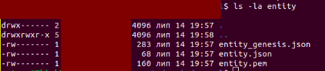
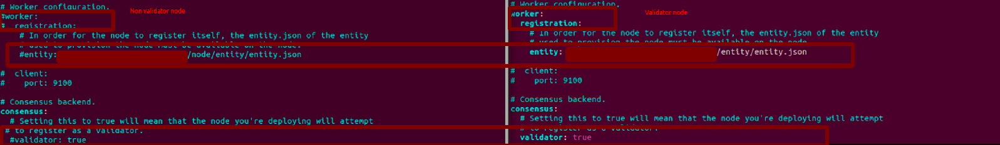
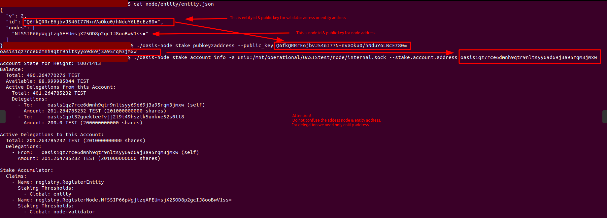

This guide covers setting up an Oasis validator node on the mainnet. If you want to get rewards for running other Oasis ParaTime nodes, you must run a validator node on the mainnet.
You will need two servers:
* The first server (“Server A”) is for a validator on the mainnet.
* The second server (“Server B”) is for storing key files and creating transactions.

 
### Requirements for Server A: 
* CPU: 2.0 GHz x86-64 CPU with 4 cores/vCPUs with AES instruction set and AVX2.
* Disk: 700 Gb. We use pruning and our database takes up much less space. We think a 240 GB drive is enough for disk scaling.
* Memory: 16Gb.
* Network:
	 Minimum: 200 Mbps internet connection with low latency.
	 Recommended: 1 Gbps internet connection with low latency.
* OS: Ubuntu 20.04.

You must have 100 ROSE.

### Requirements for Server B:
  This host can be used to store keys. You can choose your localhost, virtual machine, or minimal PC for Ubuntu 20.04 . The Oasis team recommends choosing a host without internet access.

### Steps to create validator:
**Note:** All transactions are created and signed on localhost [without an internet connection](https://docs.oasis.dev/general/run-a-node/set-up-your-node/run-validator#systems), so we store the private key (entity.pem) on the localhost (Server B).
#### Step 1.Install a non-validator node on Server A
Create a user: 
```
sudo useradd -m oasis
#Add user to group sudo
sudo usermod -aG sudo oasis
#In next we perform all operation from user oasis
#Change user to Oasis 
sudo -s
su oasis
```
Create a var:
```
#This directory must have access to 240 GB and be scalable 
OASIS_PATH=”You_puth_to_folder_for_oasis”
EXTERNAL_IP=”You_external_IP”
echo 'export OASIS_PATH='${OASIS_PATH} >> $HOME/.profile
echo 'export EXTERNAL_IP='${EXTERNAL_IP} >> $HOME/.profile
source $HOME/.profile
```
Create a folder for Oasis:
```
#Create folders 
mkdir -p $OASIS_PATH/node/etc
mkdir $OASIS_PATH/node/data
#Change directory access rights 
sudo chmod 700 $OASIS_PATH/node/etc
sudo chmod 700 $OASIS_PATH/node/data
```
Clone this repo:
```
cd $OASIS_PATH
git clone git@github.com:everstake/oasis-documentation.git
```
Copy the config file with base pruning edits and a more optimal configuration: 
(Note: The config is for Version 22.1.7. A config for newer Oasis Core versions may differ. Please see the [official documentation.
](https://docs.oasis.dev/general/run-a-node/set-up-your-node/run-non-validator#configuration)
```
#Copy config file
cp $OASIS_PATH/oasis-documentation/config/config_oasis_mainnet_non_validator.yml  $OASIS_PATH/node/etc/
#Change the path in the config file  
sed -i.bak -e "s|\/node|$OASIS_PATH\/node|g" $OASIS_PATH/node/etc/config_oasis_mainnet_non_validator.yml
#Change the name of the config file 
mv $OASIS_PATH/node/etc/config_oasis_mainnet_non_validator.yml $OASIS_PATH/node/etc/config.yml
```
Create a system.d unit:
```
sudo vim /etc/systemd/system/oasis-mainnet.service

[Unit]
Description=Crypto OASIS
After=network-online.target
[Service]
Type=simple
Restart=always
RestartSec=5
TimeoutSec=30
User=oasis
WorkingDirectory=PATH
ExecStart=PATH/oasis-node --config PATH/node/etc/config.yml
StandardOutput=append:PATH/stdout.txt
StandardError=append:PATH/stderr.txt
StartLimitInterval=15
LimitSTACK=65535
LimitNOFILE=102400
[Install]
WantedBy=multi-user.target

#Replace your path on system.d to oasis folder 
sudo sed -i.bak -e "s|PATH|$OASIS_PATH|g" /etc/systemd/system/oasis-mainnet.service
```
[Download the current version genesis](https://docs.oasis.dev/general/oasis-network/network-parameters/)
```
wget --directory-prefix=$OASIS_PATH/node/etc/ https://github.com/oasisprotocol/mainnet-artifacts/releases/download/2022-03-03/genesis.json
#Please check if the version of genesis is actual according to the Oasis documentation. You can check this with the below command:
sha256sum $OASIS_PATH/node/etc/genesis.json
```
Download the current Oasis Core version:

(Note: We use Version 22.1.7. Please check the [documentation](https://docs.oasis.dev/general/oasis-network/network-parameters/) for the current Oasis Core version.)
```
wget --directory-prefix=$OASIS_PATH https://github.com/oasisprotocol/oasis-core/releases/download/v22.1.7/oasis_core_22.1.7_linux_amd64.tar.gz
tar -xvzf oasis_core_xxxx_linux_amd64.tar.gz
cp oasis_core_xxxx_linux_amd64/oasis-node $OASIS_PATH/
```
Add iptables rules for P2P:
```
#Add rule for p2p oasis consensus
sudo iptables -A INPUT -p tcp -i <Name_your_external_interface>  --dport 26656 -j ACCEPT -m comment --comment "p2p Oasis"
#Save rules
sudo netfilter-persistent save
```
Start Oasis and wait until it is synced: 
```
sudo systemctl daemon-reload
sudo systemctl start oasis-mainnet.service
#Checking if node is synced
$OASIS_PATH/oasis-node control is-synced -a unix:$OASIS_PATH/node/data/internal.sock
```
```
#You must see this output:
node completed initial syncing
```
Wait for the node to sync and then proceed to Step 2. 

#### Step 2: Create a var on Server B
```
#Check path to oasis folder
echo $OASIS_PATH
#If you don’t have path pls do next command
OASIS_PATH=”You_puth_to_folder_for_oasis”
echo 'export OASIS_PATH='${OASIS_PATH} >> $HOME/.profile
source $HOME/.profile
```
#### Step 3: Create an entity on server B. The entity will be used to register the node on the network and it will sign transactions, too.
Create a folder to store keys:
```sh
mkdir $OASIS_PATH/“Name_Your_folder_for_store_keys”
```

Download the [current Oasis Core version](https://docs.oasis.dev/general/oasis-network/network-parameters/)

(Note: In this example, we use Oasis Core 22.1.7. Please check the [oasis documentation](https://docs.oasis.dev/general/oasis-network/network-parameters/) for the current Oasis Core version.)
```sh
wget --directory-prefix=$OASIS_PATH https://github.com/oasisprotocol/oasis-core/releases/download/v22.1.7/oasis_core_22.1.7_linux_amd64.tar.gz
tar-xvzf $OASIS_PATH/oasis_core_xxxx_linux_amd64.tar.gz
cp oasis_core_xxxx_linux_amd64/oasis-node $OASIS_PATH/
```
Download the [current genesis version](https://docs.oasis.dev/general/oasis-network/network-parameters/):
```sh
wget --directory-prefix=$OASIS_PATH/etc/ https://github.com/oasisprotocol/mainnet-artifacts/releases/download/2022-04-11/genesis.json
PLease check if the version of genesis is actual according to the oasis documentation. you can check this with below command
sha256 $OASIS_PATH/node/etc/genesis.json
```

Init the entity:
```sh
$OASIS_PATH/oasis-node registry entity init \
   --signer.dir ./entity
```
After this command, we have a new folder entity with an entity key:



entity.pem contains your private validator key. Do not send this key to anyone. This key will sign all our transactions, too.

Next, we will show an example with our entity. You will have to do the same with you entity:
```sh
#Print entity id
cat entity/entity.json
output:
{
    "v": 2,
>>  "id": "Q6fkQRRrE6jbvJ546I77N+nVaOku0/hNduY6LBcEz80=",
    "nodes": [
      "NfSSIP66pWgjtzqAFEUmsjX25OD8p2gcIJ8ooBwV1ss="
  ]
}

#Input  --node.entity_id   --node.consensus_address 
./oasis-node registry node init \
  --node.entity_id Q6fkQRRrE6jbvJ546I77N+nVaOku0/hNduY6LBcEz80= \
  --node.consensus_address “You_public_ip_host_A:26656” \
  --node.role validator \
  --datadir ./node

./oasis-node registry entity update \
  --entity.node.descriptor ./node/node_genesis.json
```
#### Step 4: Copy the entity and *pem files, node_genesis.json files from Server B to Sever A

**Note**: Store entity.pem on the separate host

Backup the key files on Host A:
```sh
mkdir $OASIS_PATH/backup
cp $OASIS_PATH/node/*.pem $OASIS_PATH/backup/node
cp $OASIS_PATH/node/data/tendermint/oasis_priv_validator.json $OASIS_PATH/backup/
#Stop oasis
sudo systemctl stop oasis-testenet.service
#Delete old key files  
rm $OASIS_PATH/node/data/tendermint/oasis_priv_validator.json
rm  $OASIS_PATH/node/data/*.pem
```
Create an entity folder on Server A:
```sh
mkdir $OASIS_PATH/node/data/entity
sudo chmod 700 $OASIS_PATH/node/data/entity
```
Copy the files from Server B to Server A:
```sh
rsync $OASIS_PATH/node/* user@You_public_ip_host_A:$OASIS_PATH/node/data
rsync $OASIS_PATH/entity/entity.json user@You_public_ip_host_A:$OASIS_PATH/node/data/entity/
```
#### Step 5: Change the config and start the validator on Server A


```ssh
#Change the configuration file as shown in the screenshot 
vim $OASIS_PATH/etc/config.yml
#Delete old key files  
rm $OASIS_PATH/node/data/tendermint/oasis_priv_validator.json
#Start oasis
sudo systemctl start oasis-test-1.service
#If all is good, execute next command & get some result
$OASIS_PATH/oasis-node registry entity list -a unix:$OASIS_PATH/node/data/internal.sock

output:
1vx76faX+ARwAY4sEoEaC9oMgZ/BFWfij17SrSS2iQ0=
WBgzYbX1ks0zB33f92JcBXdb5kVam7Sx1G7uepugqBI=
/WtQZM18TNzYdWRlLn4SW7Orn/dK3O5iuLXqBsIiaws=
eDSVqk3OC1t5/HzTcdLJH0nZ4FVCv1ikXrY0JMbYgco=
qbhau6XE1yyyroGHvViop2dsOfu+FqWKleQh4g8YJeU=
dXBtIJ1+LMkIaydaSUS3quh4bHFgjf8kSJd6n666lk8=
e4GM0u20JKAwvV7cUeix1J7JW1mLFiMetiMNzbDYm9U=
4eM2SdjntkGGH0DqhloG8HJsPNSoEeYHFACuOV+9qbc=
rL/+w2kRZEMSMn80TOooMa/UtyuDsI2zurI1u0ppoVY=
dyB+VjBP2/rkIL8/7E4cymsTvC2pW5lkxawGzEP2IMw=
Qx5rjTtsUmCEj+WAuD91ABSsNpHIkDmHpTWPVkiwQ2g=
RKCvE04I/BWb7VC6tzAetR3cLSlmPOrshElcoFLCjnk=
efBR83hww44OezMuvJ0T9Ewu4uPSQkOlO7EQq79KSis=
jDezUtFXRI6/x59WHVR49KlO7EWQZ29reqt043IyWFo=
CodKtsDcAtmZzkpgR9/yYei38EeSDuKYONbK4d8nQDM=
y5OPggar3ldUM8QYKK5VmYpjuDytsahBI50C6i45VL4=
ekP4j+817Qhh3/DruBXVv/8ypI2CAnK1LAfuVxNazNc=
VseMH3jtLw9H1q/ziOpI+vUE1aeqmcmsiO+oZVooKYg=
6fFUt3pRUm/GJyrmOycNWc4SRmEq+gCwJnrDLWZDf6s=
qfCvu3ktglzmQFd9Cca5XwNHecCfP/P2tMrK/34x430=
vwQq/RPLChWQEn+WjZv0diM2+EFBxy3JK7OQ8PjxZbk=
nYK6gmglTXBNesG8vSFhh0V5b/BGubFCHz83XFgiQRM=
ucBShpGap3zSeKqkAo5XRcfeOZrvQYAK37CKUHrCK9A=
khYFxt0Pk62HJZbp1MMzTwQXGEXfrX7pJ2Em4yy16ng=
Efqu3z0lip+aDXkJUZqL9KfqpUIrgvISgGOdE/3OITw=
Y1FLFDa4o7JbRnjHc53AwvHzUEEShwEicxREwaKkPks=
np5ghSwh8QmA2CwtvgtbQ2p+BDspieZ5u9gu6pczHuo=
L/xlgKf4Tx1XZogRBnuBmFS52NFoccW6QjMA8VS7g1g=
HR0X7WBEzfRGf37ZE/TpTz6eC9x59SXEnSbIYNrwvW4=
+4Jci3+lZhOb4be2QI4zyVrsnVapGeM5GemV9F97jt0=
bLgW7X3Ke7gUyyzDUjEf9rDvEAMGRa0hb4Vj8jtPOgY=
KzotvVsgmTBNDsyHdv0CZzQBBi3r9lcKxWuCD0uFQcY=
oLM78jZoGtkkx/0zN4CLGbucWCreI/N5JbIHP5UJO9k=
rbUaXSUbCvrZrYiC0H4eLyGVZvrFkQEOrQoZjaDAolE=
ZdA1Wc50Pe3eWSUcmiznyOwApRTSHg3xFgjSHuv1Zjo=
05jsjn/iCQGDML4AJIwpcY2EmiBAMNDLSWk4x6c+1co=
GyGpyyKYw4r28ByzFLtvu7qEoa0HFMhG4CVDbK1RXw8=
w+RegHqNnDGjEHukprzt4CZGr24ZJ8NY7scX7yuK2R4=
8bXxje9Ju4CAu3F8rRX+NIRsdFJd97v7F9oiTOvd9y4=
tzwvhifJZEMMSWsRxDvQnjggyW87NxSi5uWNb++fpXc=
QTg+ZjubD/36egwByAIGC6lMVBKgqo7xnZPgHVoIKzc=
6Z6kefGqCQSNBvPd/whNez9YwS9QlLSKCmhWviZ1xg0=
i8peRo2Ueh6QohfYCyOEkBRSSU1oyVCES/29HZJbLOc=
bvUTh6r0m7zQSHutiMVq+V9HdxU2bCLWrlnsUi3RsBs=
7lfYUvN5rbAnyjN+TxNfVcAfqcHO+DBfur/YN6+4as8=
ZxJyyH+JPdGNfjy+ZPq+GpFY0fAJKm9VFXZIPwMcKm4=
sKJ7WWqPBgo7Qg03SLb/lgO7J67BybQiFXn1cwMSFjU=
W4mvWjUL27JnIbC3iQOlrKdpsIVFoQ8RDpt6wv1mocw=
/RupFkoz/Hep2Xm1eqtzwuLw+hS2AQNiKVgqQwnMalE=
W/Fj1JlO2hAgVSohQZZ3OQDb39Yf9O/jXxcOeW5E6AQ=
QTuLasKq0SGbbpEW2a5+MbOACxeIAZXtl0HXyiL13Vs=
Q6fkQRRrE6jbvJ546I77N+nVaOku0/hNduY6LBcEz80=
PEb8ShxIssJ2OOo0KJSsdvYe8wlQeGoS8xr+I/T0EB4=
PI1h32Qi6zr0lnw1lZkPl8RPYCYpng1S9NNx1tCFUMc=
3rejeMi11blc6t8T2sjJMeGIWQtbngFu/66HxWhlH1s=
LMByxWPjHKNOPuF5p0nigt7qf2P5VWA9OdnGYV6gJt0=
IDrC50ExgNOjHYJjzHYMttOR7X94rSa33yoYXCCkTtU=
t3jFBQQFkoVajtoje2EHB9oYiHYpoiaARtI2sag3+vU=
IRvPVE480/nTZf6WqEaxVhkPxstagLuG8WVO8O8izBg=
qFHb6b2QXMuOgJZpbYe7xThBTsrd+lC5xDthTt2bIhs=
CGLzGaag7SXxFqZmjSuwxGIndj0w7PbUoJzQVHYoGUU=
Ll57tFW+hM4jSBofpR8LVVSLYuz/FX73apLb7WyN2jc=
f7ZHY75gi10C9jQXz4N3P/4dRQv//LA+29SuW02nZVQ=
+fzk/Pi4DBmPhCzs8Gsw+jrbv9Z6HMfIdohb/hqWe7g=
W51yg1gYW3yRwgnGYyGFGPW6YF/cnVoJYfALZNhWdhk=
LXXBwwqBgwP3Jd3qCAWDpDBYmeMvX0mtmCsCUveGKuk=
PGMKLRU4WLT1qF5KxyUCiQz9FmbcytP7GGGuJmGrhoo=
rZ19d5W6Y9yv8AeZsX/Yu/zW4bAL186ZV9FnJTO3/zg=
NbbWxhQ2vdkBnWtiH4/qs8I7m8bENKZ9oQxMfYjOaA0=
eAktV5Y92L53zBVNuS+pVXjlwZ35BbGLjSXgS/niLzM=
woGoSsLnjeRZUARIBDo5Y/1VY0JRyQZ/M6+3GLU8BmQ=
QgG1hFl4On84uVIrd++d3HxwoirdopH6oRmpltAIxxQ=
WfLM2tJM1E586dI7myztwIEUQ2mFBoQa4lIbMNfDo+A=
3xW+S+VeZ4atGmmxgfKfq0dDsIpe357CPrv56guaIng=
LMoB+QiEaKQEbFP8dXfJ5GEhMLQgOlg8tN+kmJUH0oE=
VypLa8FdEymI0K+Dy+UgDwr+1cdsSZtyhH++oAnrce0=
28aMPjNWp+uKage0NlFpb3W7T/en7HRZfLk4xcZqD0U=
1hmCxnf7eO1+b4tQ5Pm7LUGaeELnFIm3satJdIAHHeU=
y0Eom9+Xnq8YoNpSS//IDts2CaZTsbEjkn8a3vdy08E=
do2LlCppPSf8mG9LMNdKUytcdQK1mMYxF3nf8+uaTfg=
ogu6Urem5rHBc0BiGYM9nFnohXXARFfYkDyV9liDMBI=
7C3hcBmlqELviUrYCTRsl0vY8GdwF5cC5ymBPVH8WSU=
pERaTagl7a57dXiVI3ZzoQbWskX3YmUHppeqcPdCVY8=
+G2csGBZ9P8Uf3Tvgfbuo3Z/1tFmqNMsiuSWen5s1qw=
d8w//BgAP3V9Bo5cgSm1eat6NKwBOzrxEC7wiOI1k0w=
VF7Mm/YtXu9sCc6eqbb16fU3K0BHa/rc4wXd9nbnveI=
h+Tz+tBZ2yjUaDQm8GjnT358tVp0nh3jH+WguJIC2jM=
yB1iGAzWLPEjRMN7Ll9ck+F0uEeHOgeQLyURzbPWb8k=
f7fGbJzqeXX2UMVK+LjJ9y/TM2SkodAxdte0IoOvNns=
f5xc3Yk/mzo3aBFaZMp80PlUjnmCkP5aj/I8i79Y/Y0=
d0oUk6mhnA1+c83M845Sn65Rp/SCTD1Kp/L3GfBc9Sg=
5sWRpPFHlmCRdKnsOSCFnhQCukqmKA9HoLYGIn8NtHk=
2xTkhlp0ISMMTKr7ksnOjj1for+Ruh/XMWDpw9zqOBY=
+lgliBmtfQ0ghj6SrEguOHr3cpS4a99Bs7iyD5pQOE0=
gSUCphbQ9ZcWncr3NCjKuGfhJ27YjMtLGFgCCp3RvFA=
uvBzfQAEUExhTRh5ssRhUyWGd1tKmdHlILml5VoFlIw=
3cn1uAKo0hyCq7gaUSAPIbFqchFJ5gAHOcyl8TcQGCw=
QNV9kTQHFWn/K+efadTjv3g3xJo3TSXpNz4FfIu/E5g=
inmsch9/EgTH/b3HLp9icW/q2W+FpWXuZh9HUgDf6zk=
F/IE4bDGhg8naE7qk09uh+ZHP+UCuWTdesrTskzu0Ok=
qg5I1u74cSaDfg9GA8SAvTxronahNfCXfj1tIjeV6hQ=
vWTEPQV+eWyCfqwnfnr4g7Vyarb68yOSpcnKkU+EVVk=
JfhckDmwdHZHCJ7DDNf620Ba0zMjUZkPSIyrWmv9sgg=
ASvYrMFbghsfG2A7a8Ufrb+Fwo73sZst1xRMrLSIE48=
dyh4HqSlTabRSgqUHmcUOUt2bmcjCkmTDL3IAZV9ZCc=
+MBgzI9mlzJsOxIDVib7XsY4X4a4YqX67dpH8It9sX4=
```

#### Step 6: Determine the validator address on Server B

**Note**: This example is for our node. You will have to do the same for your node.

```sh
#watching entity id
cat $OASIS_PATH/node/entity/entity.json
output:
{
  "v": 2,
  "id": "Q6fkQRRrE6jbvJ546I77N+nVaOku0/hNduY6LBcEz80=",
  "nodes": [
    "NfSSIP66pWgjtzqAFEUmsjX25OD8p2gcIJ8ooBwV1ss="
  ]
}

#substitute our entity id
$OASIS_PATH/oasis-node stake pubkey2address --public_key Q6fkQRRrE6jbvJ546I77N+nVaOku0/hNduY6LBcEz80=
output:
oasis1qz7rce6dmnh9qtr9nltsyy69d69j3a95rqm3jmxw

#See Account state from address( in this example, we see information after registration validator & self delegation, when we do this command fist time , we see only balance), also we need nonce, 
$OASIS_PATH/oasis-node stake account info -a unix:$PATH_OAIS/node/internal.sock --stake.account.address oasis1qz7rce6dmnh9qtr9nltsyy69d69j3a95rqm3jmxw
output:
  Account State for Height: 10071252
  Balance:


>> Nonce: 6
```
#### Step 7: Create a transaction and check you nonce with the previous command for your address (on server B)
```sh
#Create folder for stores transaction
mkdir $OASIS_PATH/tx
```
Make a transaction for escrow:
```sh
#Input: --stake.escrow.account, --stake.amount(min amount 100 TEST toke, we need to add 000000000 to our amount, in this example we escrow 201 Rose token),--transaction.nonce  in the first transaction nonce=0, nonce is a number of transaction, each next transaction increases nonce to 1 )  
$OASIS_PATH/oasis-node stake account gen_escrow \
  --genesis.file ./etc/genesis.json \
  --signer.dir ./entity \
  --stake.escrow.account “Your_entity_adress” \
  --stake.amount 201000000000 \
  --transaction.file .tx/tx_0_escrow.tx \
  --transaction.fee.gas 2269 \
  --transaction.fee.amount 1000 \
  --transaction.nonce 0
```
Create a transaction register entity:
```sh
$OASIS_PATH/oasis-node registry entity gen_register \
  --genesis.file ./etc/genesis.json \
  --signer.backend file \
  --signer.dir ./entity \
  --transaction.file ./tx/tx_1_reg_entity.tx \
  --transaction.fee.gas 2460 \
  --transaction.fee.amount 1000 \
  --transaction.nonce 1
```
Check a transaction if you have doubts about the transaction signer’s identity or other details (Optional): 

(Note: the Signer field contains a public key for the signer.)
```sh
$OASIS_PATH/oasis-node consensus show_tx -g etc/genesis.json --transaction.file 
output:
tx/tx_5_reg_entity.tx
Hash: 291ccf114c237eacc8515555ae4cc1da5839b23fd7f8dce0198d2274cb4e348f
Signer: Q6fkQRRrE6jbvJ546I77N+nVaOku0/hNduY6LBcEz80=
        (signature: Y9RDURZzq1yzOR71KXOTRfQK1yesKLLdAU1JZK1nzbKKxAhRIQqqNNxxQNIjGpJ+rYHvNeKOtpcGF+MCDyFGAQ==)
Content:
  Method: registry.RegisterEntity
  Body:
    {
      "untrusted_raw_value": {
        "v": 2,
        "id": "Q6fkQRRrE6jbvJ546I77N+nVaOku0/hNduY6LBcEz80=",
        "nodes": [
          "NfSSIP66pWgjtzqAFEUmsjX25OD8p2gcIJ8ooBwV1ss="
        ]
      },
      "signature": {
        "public_key": "Q6fkQRRrE6jbvJ546I77N+nVaOku0/hNduY6LBcEz80=",
        "signature": "UxwUd01QtcNFPdXVrPiM2JguPqNAy/sFZqJCwjipHjgu4Ito2kLeD3KDOHxjakLhm9x2VWUalVN6BvFf4tBUAQ=="
      }
    }
  Nonce:  5
  Fee:
    Amount: 0.000001 TEST
    Gas limit: 2460
    (gas price: 0.0 TEST per gas unit)
Other info:
  Genesis document's hash: 50304f98ddb656620ea817cc1446c401752a05a249b36c9b90dba4616829977a~`
```
#### Step 8: Copy transactions from Server B to Server A and submit transactions on Server A
Copy transaction from Server B to A
```sh
rsync $OASIS_PATH/tx/tx_0_escrow.tx user@ip_adress_host_A:$OASIS_PATH/node/etc/tx/
rsync $OASIS_PATH/tx/tx_1_reg_entity.tx user@ip_adress_host_A:$OASIS_PATH/node/etc/tx/
```
Submit transaction on Server A:
```sh
#Self Escrow tokens
$OASIS_PATH/oasis-node consensus submit_tx \
 --transaction.file ./etc/tx/tx_0_escrow.tx \
 -a unix:$OASIS_PATH/node/internal.sock \
 --datadir $OASIS_PATH/node/data \
 --log.level DEBUG
#registration entity
$OASIS_PATH/oasis-node consensus submit_tx \
 --transaction.file ./etc/tx/tx_1_reg_entity.tx \
 -a unix:$OASIS_PATH/node/internal.sock 
```
Check the status node:
```sh
$OASIS_PATH/oasis-node control status -a unix:$OASIS_PATH/node/data/internal.sock
```
The output of this command must be```"is_validator": true```
 
If you did something wrong, and the transactions went to the network, then redo your transactions, taking into account that the nonce has changed.
#### Step 9: Backup the validator key on Server B.
Backup the current entity files and validator key files to a Mainnet_validator_key folder:
```sh
#Create folder for validator key
mkdir -p $OASIS_PATH/Mainnet_validator_key/node
sudo chmod 700 $OASIS_PATH/Mainnet_validator_key
#Copy key files for validator consensus node before we create new *pem files & node_genesis.json
cp -r $OASIS_PATH/node  $OASIS_PATH/Mainnet_validator_key/
#Delete *pem files & node_genesis.json
rm $OASIS_PATH/node/
```
#### Step 10.After starting the validator node, we can register our entity on [oasisscan.com.](https://www.oasisscan.com/validators/detail/oasis1qz8u0zqhcmgxalnjgwj6m0sg6wuy2vrsgyna2z7t)To make your validator information look like ours, use Oasis Metadata Registry Tools on Host A

Build the [Oasis Metadata Registry Tools](https://github.com/everstake/oasis/blob/main/config/entity-metadata.json) & execute next command with entity-metadata.json
```sh
$OASIS_PATH/oasis-registry entity update \
  --signer.dir ${path_to_entity} \
  entity-metadata.json
```
This command creates a "xxxxxxxxxxxxxxxxxxxx.json" file in the directory ./metadata-registry-tools/oasis-registry/registry/entity.

Fork this [repo](https://github.com/oasisprotocol/metadata-registry):
```sh
git clone ${Fork repo}
#Copy the file we made above
cp /metadata-registry-tools/oasis-registry/registry/entity/xxxxxxxxxxxxxxxxxxxx.json /metadata-registry/registry/entity
#add file to git offline
git add .
#add commit
git commit -m "Add “Your_organization_name” Metadata on mainnet consensus"
#Push changes to repo
git push
```
